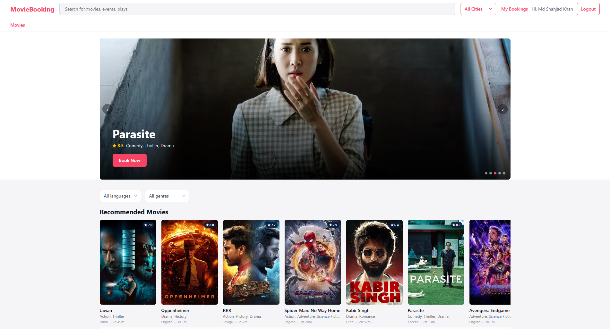
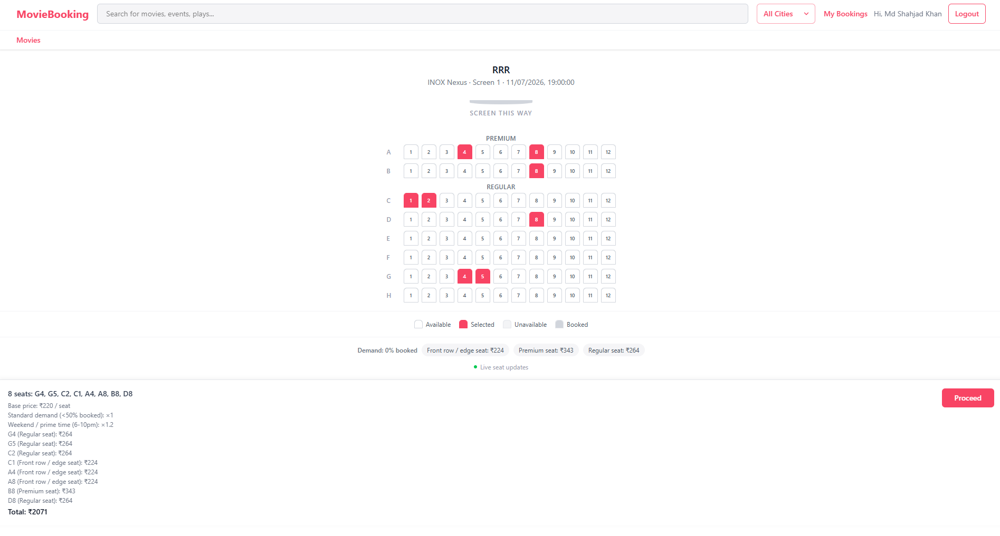
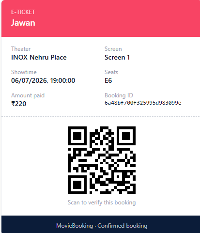
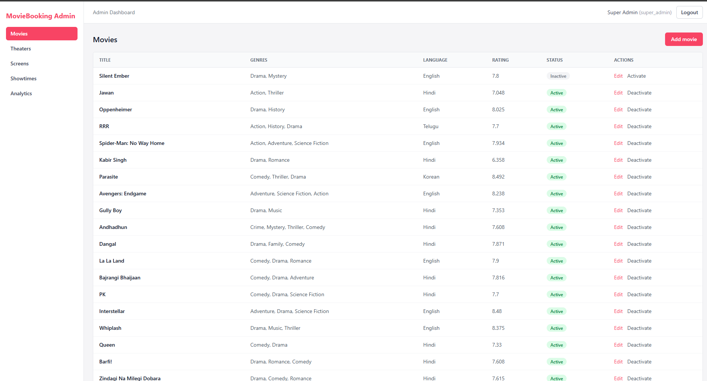
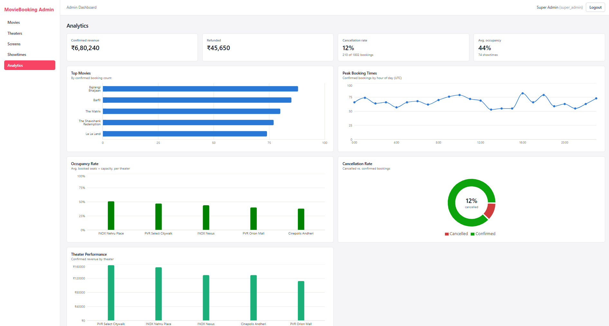

# 🎬 MovieBooking

A full-stack MERN movie ticket booking platform — real-time seat selection with Redis-backed concurrency-safe locking, a sliding-window seat recommendation engine, Stripe payments, dynamic pricing, and an event-driven waitlist.


## 🔗 Live Demo

**[movie-tct-booking.vercel.app](https://movie-tct-booking.vercel.app)**

> The backend is hosted on Render's free tier, which spins down after inactivity — the **first request can take ~30-50 seconds** to wake it up. Subsequent requests are fast. If the seat map or movie list looks empty on first load, give it a moment and refresh.

---

## 📸 Screenshots

<!--
  Drop images into docs/screenshots/ with these filenames and they'll render
  automatically below.
-->

| | |
|---|---|
| **Home — hero carousel** | **Seat selection — live locks & price breakdown** |
|  |  |
| **E-ticket with QR code** | **Admin dashboard** |
|  |  |
| **Analytics charts** | |
|  | |

---

## ✨ Features

### For moviegoers
- Browse movies with search, city/genre filters, and a hero carousel of featured titles
- Real-time seat map — see other users' locks appear/disappear live via Socket.io
- **Smart seat recommendation** — "pick my seats" finds the best block for a group in one click
- Transparent, itemized price breakdown per seat before paying (occupancy, position, time-of-day)
- Secure checkout with Stripe, e-ticket with scannable QR code
- Booking history, cancellation with a clear tiered-refund policy
- Join a waitlist for a sold-out showtime and get notified the moment seats free up

### For admins
- Role-based dashboard (`super_admin` sees everything; `theater_admin` is scoped to their own theater)
- Full CRUD for movies, theaters, screens, and showtimes
- Configurable seat layouts per screen (rows, columns, seat categories, blocked seats)
- Revenue, occupancy, top-movies, peak-booking-hour, and per-theater performance analytics with charts

---

## ⭐ Technical Highlights / Engineering Challenges Solved

### Smart Seat Recommendation Engine
Given a seat grid and a requested seat count, a sliding-window scan finds the best *contiguous* block in **O(total seats)**: each row is scanned once, tracking a running streak of available seats so a window of width `n` is validated in O(1) per step rather than rescanning. Candidate blocks are scored by a weighted cost function — distance from horizontal center + distance from an "ideal" row band (not front-row-close, not back-row-far, with front rows penalized more steeply than back rows). When no single row can seat the whole group, a fallback splits the party across adjacent rows: it evaluates every plausible shared column "anchor," lets each row pick its closest-matching window to that anchor, and scores the combination jointly — so the split stays visually clustered instead of scattering diagonally across the theater.

### Concurrency-Safe Seat Locking
Seat holds use Redis `SET NX PX` — an atomic set-if-not-exists-with-expiry in a single command, which is what actually guarantees exactly one of two simultaneous lock attempts on the same seat wins. Multi-seat locking is all-or-nothing: if any seat in a request is unavailable, every seat it *did* acquire in that same request is rolled back via an ownership-guarded Lua script (never a blind `DEL`, which could delete a lock someone else legitimately re-acquired after this one expired). Verified with genuinely concurrent race-condition tests (`Promise.all` firing two real lock attempts at once), not just sequential assertions.

### Payment Reliability
The Stripe **webhook is the sole authoritative path** that ever confirms a booking — the client-side payment callback is never trusted to commit anything. The webhook route is mounted before `express.json()` so Stripe's raw request body survives intact for signature verification. Booking-commit is idempotent against Stripe's at-least-once delivery: an atomic `findOneAndUpdate` claims the `pending → confirmed` transition, so a redelivered event finds nothing left to claim and safely no-ops instead of double-processing. At commit time, lock ownership is **re-verified** against the exact token stashed at checkout — if the hold expired mid-payment, the booking is marked failed and automatically refunded rather than silently confirming a seat that's no longer actually held.

### Real-Time Seat Availability
Socket.io rooms are scoped per-showtime (`showtime:{id}`), so a lock/release only broadcasts to clients actually viewing that showtime. Socket emits are entirely decoupled from the locking logic itself — every emit is wrapped to only log on failure, never throw — so seat locking keeps working correctly even if sockets are down, misconfigured, or not initialized at all (e.g. in tests). The frontend degrades gracefully to its normal fetch-based polling if the socket connection fails, and re-joins its rooms automatically on reconnect.

### Dynamic Pricing Engine
Final price = `basePrice × occupancyMultiplier × positionMultiplier × timeMultiplier`. Occupancy surge is tiered (standard <50%, +15% at 50-75%, +30% at 75-90%, +50% at 90%+); seat position discounts front-row/edge seats before premium category is even considered (viewing angle matters more than label); time-of-day rewards prime evening/weekend slots and discounts matinees. Critically, **the client never sends a price** — `createCheckout`'s request body has no price field to trust in the first place, so the amount charged is always recomputed server-side from live occupancy at the moment of checkout.

### Event-Driven Waitlist
A FIFO queue per showtime, skip-aware (a party of 4 waiting behind a party of 2 doesn't stall the queue while only 2 seats are free — the earliest entry that actually *fits* wins). A notified user's offer is a real, time-limited Redis lock, so it's exclusive by construction and reuses the exact same booking-ownership checks as a normal lock. Offers push to the user instantly via a personal Socket.io room. Because Redis TTLs don't emit expiry events on their own, staleness is reconciled from the Mongo-side `notifiedAt` timestamp at every natural checkpoint (a `processWaitlist` call or the user checking their own status) — an expired, unbooked offer is released and automatically cascades to the next eligible waiting entry.

### Cancellation + Refund Policy Engine
Tiered, time-based refunds: 24h+ before showtime is a full refund, 6-24h is 50%, under 6h is none (and cancellation is refused entirely once the showtime has started). The `confirmed → cancelled` transition is claimed atomically via `findOneAndUpdate` *before* Stripe is ever touched, so a genuinely concurrent double-cancel race — verified with a real parallel-request test — always has exactly one winner; the loser fails cleanly with `ALREADY_CANCELLED` instead of issuing a second refund.

### Analytics via MongoDB Aggregation Pipelines
Revenue, top movies, occupancy, peak booking hours, and per-theater performance are each computed server-side with aggregation pipelines — `$lookup` to join across Booking → Showtime → Movie/Theater collections, and `$facet` to compute an overall average *and* a per-theater breakdown in a single pass so the expensive join stages only run once. Role-scoping is baked directly into each pipeline's `$match` stage (a `theater_admin`'s `theaterId` is injected before the query runs), not filtered out of a larger result afterward — there's no code path where a scoped admin's response payload could ever contain another theater's raw documents to begin with.

### Production Hardening
- **Redis-backed distributed rate limiting**, not the default in-memory counter — an in-memory count is per Node *process*, so the instant this app runs as more than one instance (autoscaling, clustering), each instance keeps its own separate counter and silently multiplies the real limit by however many instances happen to serve a given caller's requests. A shared Redis store keeps the limit the limit regardless of instance count.
- A much stricter, dedicated rate limit on `/api/auth/login` and `/api/auth/signup` specifically — the two endpoints an attacker would actually use to brute-force a password or mass-create accounts.
- `helmet` for security headers (CSP, HSTS, X-Frame-Options, disabled `X-Powered-By`).
- A **custom NoSQL-injection sanitizer**, hand-rolled because `express-mongo-sanitize` mutates `req.query`/`req.params` by reassignment — which throws under Express 5, where both are read-only getters. This sanitizer mutates matched objects' own properties in place instead, so it works correctly regardless of Express version, stripping any `$`-prefixed operator key or dotted field path recursively through body/query/params.
- `app.set('trust proxy', 1)` in production — Render sits in front of the app as a reverse proxy, and without trusting it `req.ip` resolves to the proxy's own address for every request, which would make the rate limiter key on one "client" for the entire internet instead of the real caller.

### Cross-Domain Auth
Sessions are httpOnly JWT cookies (never exposed to client JS, immune to XSS token theft). Cookie flags are environment-aware: `sameSite: 'strict'` and `secure: false` in local dev (both frontend and backend on `localhost`), switching to `sameSite: 'none'` + `secure: true` in production — required because the Vercel frontend and Render backend are genuinely different origins, and a cross-site cookie needs both flags set correctly or browsers silently drop it.

### TMDB Integration
The movie catalog is real data (titles, posters, cast, ratings, certification) fetched from TMDB — but **only at seed time**, never at runtime. The running app never makes an external API call to serve a request, so it stays fast and has no external dependency to fail mid-request; every seeded movie is still genuinely bookable end-to-end. The seed script retries transient network failures with backoff, since TMDB has been observed to intermittently reset the TLS connection before ever reaching their server.

---

## 🛠 Tech Stack

| Layer | Technology |
|---|---|
| Frontend | React 19, Redux Toolkit, React Router, Tailwind CSS, Recharts |
| Backend | Node.js, Express 5 |
| Database | MongoDB + Mongoose |
| Cache / Locking | Redis (Upstash), atomic `SET NX PX` + Lua scripts |
| Payments | Stripe (test mode), webhook-driven commit |
| Real-time | Socket.io |
| Auth | JWT (httpOnly cookies) + bcrypt, role-based access control |
| Testing | Vitest — 81 tests against real MongoDB Atlas, Redis, and Stripe test-mode |
| Infra | Vercel (frontend), Render (backend), MongoDB Atlas, Upstash Redis |

---

## 🏗 Architecture

### Data model

`User` · `Movie` · `Theater` · `Screen` · `Showtime` · `Booking` · `WaitlistEntry`

```
Theater ──< Screen ──< Showtime >── Movie
                          │
                          ├──< Booking >── User
                          └──< WaitlistEntry >── User
```

- `Screen` references `Theater` (a theater has many screens); `Showtime` references `Screen` and `Movie` (a screen hosts many showtimes over time). `Booking` references `Showtime`, `Theater`, and `User` directly — `Theater` is denormalized onto `Booking` at creation specifically so every analytics pipeline can scope by theater with a single-field `$match`, with no extra `$lookup` hop needed just to find out which theater a booking belongs to.

### Key design decisions

- **References vs. embedding.** `Screen` is its own top-level collection (many showtimes reference the same screen over time — embedding it in `Showtime` would duplicate the whole seat layout on every single showtime document). The seat **layout itself** (`rows`, `columns`, `seatCategories`, `unavailableSeats`) is embedded *inside* `Screen`, because it's never queried independently of its screen — there's no use case for "find all layouts" separate from "find this screen's layout."
- **Seat layout as config, not one document per seat.** A screen's layout is a compact config object, not 200 individual `Seat` documents. The recommendation engine and pricing logic both work off an in-memory grid built fresh from that config (`buildSeatGrid`) — generating a 200-seat grid from a dozen config fields is cheap, and it means there's nothing to keep in sync between a `Seat` collection and reality.
- **A single source of truth for seat availability.** "Is this seat takeable right now?" is always the union of *active Redis locks* (temporary holds) and *confirmed bookings* (permanent) — computed fresh in one place (`getUnavailableSeatIds`) and reused for the seat grid, the price calculation, the `/locks` endpoint, and the broadcast payload. Nothing else is allowed to independently decide what counts as "unavailable."
- **Seed-time vs. runtime external API calls.** TMDB is called only from the seed script, never from a request handler — see the TMDB section above. This is a deliberate boundary: seed scripts are allowed to be slow and retry-heavy; the live app is not allowed to depend on a third party's uptime to serve a movie listing.

---

## ✅ Testing

**81 tests, all passing**, run with Vitest against **real infrastructure** — an actual MongoDB Atlas cluster, a real Upstash Redis instance, and Stripe's real test-mode API — not mocks. That was a deliberate choice: mocked integration tests can pass while the real integration is broken (a schema drift, a Redis command that doesn't do quite what you assumed); hitting the genuine services in tests catches that class of bug before production does.

| Area | Coverage |
|---|---|
| Seat recommendation algorithm | Single-row window selection, scoring, the adjacent-row split fallback, edge cases (grid too small, no seats available) |
| Seat locking | **Genuinely concurrent** race tests (two simultaneous lock attempts on the same seat — exactly one wins), partial-failure rollback, ownership-guarded release, TTL expiry |
| Booking + Stripe webhook | Full checkout → webhook → confirmed flow, expired-lock-at-payment-time handling, **idempotent duplicate webhook delivery**, bad-signature rejection, server-side price computation independent of client input |
| Cancellation + refunds | All three refund tiers, post-showtime rejection, ownership enforcement, **concurrent double-cancel race** (never double-refunds) |
| Waitlist | Join/leave/duplicate prevention, FIFO with skip-ahead, cancellation-driven notification, hold-expiry cascade to the next user |
| Dynamic pricing | Every multiplier tier (occupancy, position, time-of-day) in isolation and combined |
| Analytics | Aggregation pipeline correctness, role-scoping (a `theater_admin` never sees another theater's data) |
| Security hardening | Rate limiting (429s, headers, route-order exemptions), **NoSQL injection sanitization**, security headers |

Run the suite:
```bash
cd backend
npm test
```

---

## 💻 Local Setup

### Prerequisites
- Node.js 18+
- A MongoDB connection string (Atlas or local)
- A Redis connection string (Upstash or local — use `rediss://` for TLS providers)
- A Stripe account (test mode) for `STRIPE_SECRET_KEY` / webhook testing via the Stripe CLI
- (Optional) A TMDB v4 read access token, only needed to run the catalog seed script

### Backend
```bash
cd backend
npm install
cp .env.example .env   # fill in the values — see table below
npm run seed:admin     # creates the super_admin from SEED_ADMIN_EMAIL/PASSWORD
npm run seed:catalog   # fetches real movies from TMDB + seeds theaters/screens/showtimes
npm run dev
```

Optional: `npm run seed:analytics-demo` backfills realistic historical bookings so the admin analytics dashboard has something to show instead of empty charts.

All required/optional env vars are documented inline in [`backend/.env.example`](backend/.env.example).

### Frontend
```bash
cd frontend
npm install
cp .env.example .env   # VITE_API_BASE_URL, VITE_STRIPE_PUBLISHABLE_KEY
npm run dev
```

### Tests
```bash
cd backend && npm test     # 81 backend tests
cd frontend && npm test    # frontend unit tests (seat grid construction)
```

---

## 🚀 Deployment

| Service | Role |
|---|---|
| **Vercel** | Frontend (static build + CDN) |
| **Render** | Backend (Node/Express API + Socket.io) |
| **MongoDB Atlas** | Primary database |
| **Upstash** | Managed Redis (seat locks, waitlist holds, rate limiting) |
| **Stripe** | Payments (test mode) |

Set `NODE_ENV=production` on the backend — this switches the auth cookie to `sameSite: 'none'` + `secure: true` (required for the cross-domain Vercel ↔ Render cookie) and makes `CLIENT_URL` mandatory for CORS.

### Backend (Render) env vars

| Var | Notes |
|---|---|
| `PORT` | Render sets this automatically |
| `NODE_ENV` | `production` |
| `MONGO_URI` | MongoDB Atlas connection string |
| `REDIS_URL` | Use `rediss://` for a TLS provider (e.g. Upstash) |
| `CLIENT_URL` | Exact deployed frontend origin, e.g. `https://your-app.vercel.app` |
| `JWT_SECRET` | |
| `JWT_EXPIRES_IN` | |
| `SEED_ADMIN_EMAIL` | |
| `SEED_ADMIN_PASSWORD` | |
| `STRIPE_SECRET_KEY` | |
| `STRIPE_WEBHOOK_SECRET` | From the Stripe dashboard's webhook endpoint for the deployed URL |

### Frontend (Vercel) env vars

| Var | Notes |
|---|---|
| `VITE_API_BASE_URL` | Deployed backend URL + `/api`, e.g. `https://your-backend.onrender.com/api` |
| `VITE_STRIPE_PUBLISHABLE_KEY` | `pk_test_...` or `pk_live_...` |
